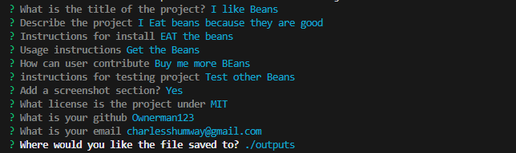
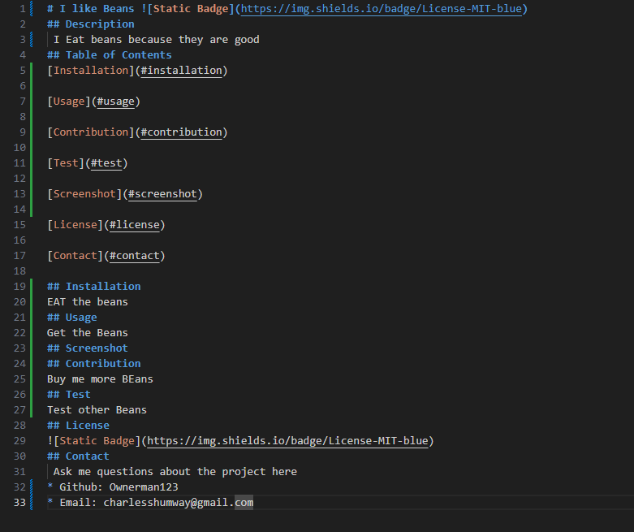
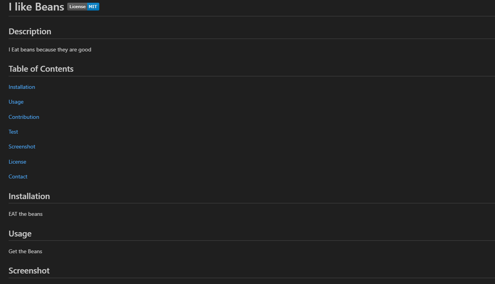

# README-Generator 
## Description 
 A program to automatically format a README for your projects because doing it manually each time sucks.
## Table of Contents
[Installation](#installation)

[Usage](#usage)

[Contribution](#contribution)

[Screenshot](#screenshot)

[License](#license)

[Contact](#contact)

[Deployed](#Deployed)

## Installation 
Run
```bash
npm i 
```
in the console to install all the needed packages 
## Usage 
Run
```bash 
node index.js
```
 in the terminal to run, then answer the 
questions to automatically create a formatted README.

Demo Video: https://watch.screencastify.com/v/NS2T5jzvmoHkl7xLb6Op
## Screenshot 






## Contribution 
This project is pretty much good as it is but if you want to help out with future projects check out the contact me section.
## Deployed
https://note-taker-v0g3.onrender.com
## License 

## Contact 
 Ask me questions about the project here
* Github: Ownerman123
* Email: charlesshumway1@gmail.com
